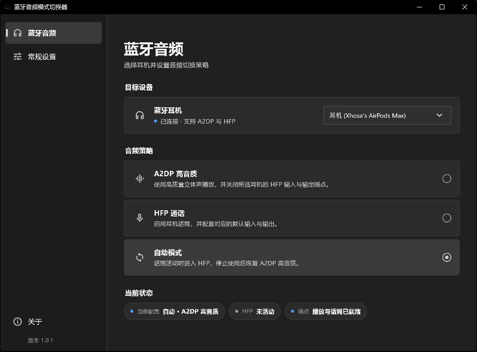
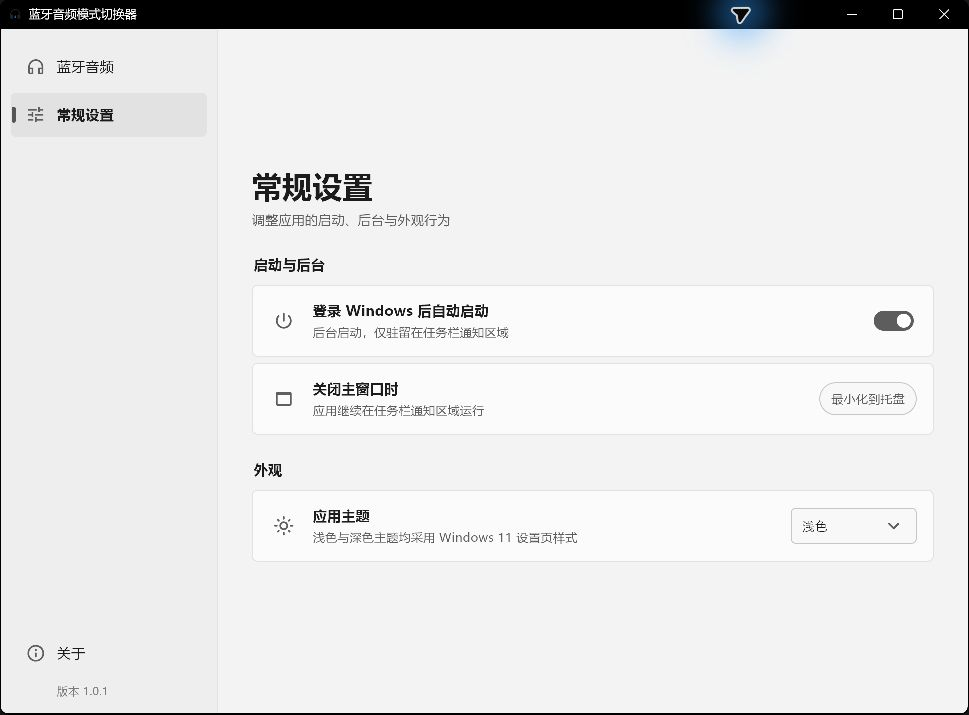

<div align="center">
  
  <h1>蓝牙音频模式切换器</h1>
  <p>面向 Windows 11 的蓝牙耳机 A2DP / HFP 音频模式管理工具</p>
  <p>
    <a href="https://github.com/XhosaS/BluetoothManager/releases/latest"></a>
    
    
  </p>
</div>

在蓝牙耳机的 **A2DP 高音质**、**HFP 通话**与**自动模式**之间快速切换。应用按照 Windows `ContainerId` 识别同一台蓝牙设备的播放与话筒端点，支持系统托盘、深浅主题、登录自启、设备重连恢复和全局单实例。

> 当前版本：**v1.0.1** · 仅支持 Windows 11 x64

## 下载与安装

- [下载 v1.0.1 安装程序](https://github.com/XhosaS/BluetoothManager/releases/download/v1.0.1/BluetoothAudioManager-Setup-v1.0.1.exe)
- [下载 v1.0.1 完整 ZIP](https://github.com/XhosaS/BluetoothManager/releases/download/v1.0.1/BluetoothAudioManager-1.0.1-win-x64.zip)
- [查看全部 Releases](https://github.com/XhosaS/BluetoothManager/releases)

推荐普通用户使用安装程序。安装时需要一次管理员权限，用于复制程序、注册配套 Windows 服务以及创建桌面和开始菜单快捷方式；日常运行不需要重复确认 UAC。

## 界面预览

### 深色主题 · 蓝牙音频



### 浅色主题 · 常规设置



## v1.0.1 更新内容

- 按照 Windows 11 设置应用重构界面，完整适配深色与浅色主题。
- 合并设备与音频模式操作，使用下拉菜单直接选择目标耳机。
- 新增自动模式：话筒活动时进入 HFP，停止使用后恢复 A2DP 高音质。
- 增加 HFP 音频会话监听和当前状态胶囊，近实时反映话筒占用情况。
- 重绘应用、任务栏、桌面快捷方式与托盘图标，统一为极简黑白灰视觉。
- 托盘右键菜单跟随应用主题，支持 Windows 原生深色菜单。
- 优化响应式窗口、悬停动效、单实例唤醒和右下角通知位置。
- 过滤 USB 等非蓝牙音频设备，减少目标设备列表中的错误匹配。

## 主要功能

- **准确关联设备**：根据 Windows `ContainerId` 关联同一耳机的 A2DP、HFP 输出和 HFP 输入端点，不依赖易变化的显示名称。
- **A2DP 高音质**：使用高质量立体声播放，并关闭所选耳机的 HFP 输入与输出端点。
- **HFP 通话**：恢复耳机话筒，并配置对应的默认输入与输出端点。
- **自动模式**：保持话筒可用，录音开始时由 Windows 进入 HFP，录音结束后恢复 A2DP。
- **活动状态检测**：监听目标耳机话筒的 Core Audio 会话，独立显示 HFP 是否正在活动。
- **设备重连恢复**：保存目标耳机与期望策略，设备重新连接后自动恢复。
- **系统托盘操作**：从托盘直接选择 A2DP、HFP 或自动模式；菜单自动适配深浅主题。
- **后台常驻**：关闭主窗口后继续在通知区域运行，可选择登录 Windows 后自动启动。
- **全局单实例**：重复启动不会产生多个后台进程，而是唤醒已有窗口。

## 三种模式

| 模式 | 适合场景 | 行为 |
| --- | --- | --- |
| A2DP 高音质 | 音乐、视频、游戏 | 使用高质量立体声播放，关闭所选耳机的 HFP 输入/输出端点 |
| HFP 通话 | 会议、语音、录音 | 启用耳机话筒，并配置对应的默认输入与输出 |
| 自动模式 | 需要在音质与话筒之间无人值守切换 | 话筒活动时使用 HFP，空闲后恢复 A2DP 高音质 |

Windows 11 的新蓝牙音频驱动通常使用统一播放端点。启用 HFP 后，只有应用真正打开耳机话筒时，蓝牙传输才会进入通话链路。因此，选择 HFP 后暂时显示“未活动”是正常现象；打开会议或录音应用后，状态会更新为“HFP 活动中”。

应用另有 30 秒低频看门狗，用于睡眠恢复或驱动漏报时校正状态，正常变化主要由 Core Audio 回调驱动。

## 使用方法

1. 连接同时支持 A2DP 与 HFP 的蓝牙耳机。
2. 打开应用，从“目标设备”下拉菜单选择耳机。
3. 选择 A2DP、HFP 或自动模式。
4. 在“当前状态”中确认实际配置、HFP 活动情况和端点就绪状态。
5. 关闭窗口后，应用会继续驻留在任务栏通知区域。

托盘菜单提供 HFP 活动状态、三个模式选项和退出操作。左键单击托盘图标可以重新打开主窗口。

## 系统要求

### 运行环境

- Windows 11 x64
- 同时支持 A2DP 与 HFP 的蓝牙耳机
- 安装阶段需要管理员权限

### 开发环境

- Flutter 3.44 或更高版本
- Visual Studio 2022，并安装 **Desktop development with C++**
- Windows 11 SDK
- Inno Setup 6（构建安装程序时需要）

## 从源码构建

```powershell
flutter pub get
flutter analyze
flutter test
flutter build windows --release
```

Release 输出目录：

```text
build\windows\x64\runner\Release
```

如果当前环境设置了 HTTP 代理且测试无法连接本地测试进程，可以临时排除本地地址：

```powershell
$env:NO_PROXY = "127.0.0.1,localhost"
$env:no_proxy = $env:NO_PROXY
flutter test
```

## 安装、卸载与打包

从源码构建后，可以运行项目自带安装脚本：

```powershell
powershell.exe -NoProfile -ExecutionPolicy Bypass -File .\scripts\install.ps1
```

卸载应用并恢复由本软件管理的音频端点：

```powershell
powershell.exe -NoProfile -ExecutionPolicy Bypass -File .\scripts\uninstall.ps1
```

构建 Inno Setup 安装程序：

```powershell
.\scripts\build_installer.ps1 -Flutter (Get-Command flutter.bat).Source
```

输出文件：

```text
installer\output\BluetoothAudioManager-Setup-v1.0.1.exe
```

构建包含应用、安装/卸载脚本和 README 的 ZIP：

```powershell
.\scripts\package_portable.ps1 -Version "1.0.1"
```

```text
build\BluetoothAudioManager-1.0.1-win-x64.zip
```

ZIP 本身不是完全免安装版；解压后仍需运行其中的 `install.ps1` 注册服务。

## 诊断与命令行切换

将当前兼容设备和端点诊断写入文件：

```powershell
.\build\windows\x64\runner\Release\bluetooth_audio_manager.exe `
  --diagnostics-file .\diagnostics.txt
```

切换第一台已连接的兼容耳机：

```powershell
.\build\windows\x64\runner\Release\bluetooth_audio_manager.exe --switch-mode a2dp
.\build\windows\x64\runner\Release\bluetooth_audio_manager.exe --switch-mode hfp
```

诊断和命令行切换不受 GUI 单实例限制。

## 项目结构

```text
assets/              应用、窗口和托盘图标资源
docs/screenshots/    README 使用的实际应用截图
designs/             Windows 11 高保真原型与设计演进
lib/                 Flutter UI、状态模型和平台通道
windows/runner/      Windows 音频端点、会话检测和桌面入口
windows/service/     配套 Windows 服务与端点恢复逻辑
scripts/             构建、安装、卸载和打包脚本
installer/           Inno Setup 配置
test/                Dart 单元与界面测试
```

## 兼容性与限制

- 仅支持 Windows 11 x64，不构建 Android、iOS、macOS 或 Linux 版本。
- 一次只控制用户选择的一台蓝牙耳机。
- 切换模式会修改 Windows 默认播放和录音端点。
- 自动模式不会禁用 HFP 话筒端点；“自动 · A2DP”表示话筒空闲时的实际高质量传输状态。
- 其他音频管理软件可能修改默认端点，应用会将不完整配置显示为“混合状态”。
- 默认端点和端点可见性切换依赖 Windows `PolicyConfig` COM 接口，Windows 大版本更新后应重新实机验证。
- 某些通话软件会自行选择音频设备，不完全遵循 Windows 默认端点设置。

## 提交代码前检查

```powershell
dart format --output=none --set-exit-if-changed lib test
flutter analyze
flutter test
flutter build windows --release
```
