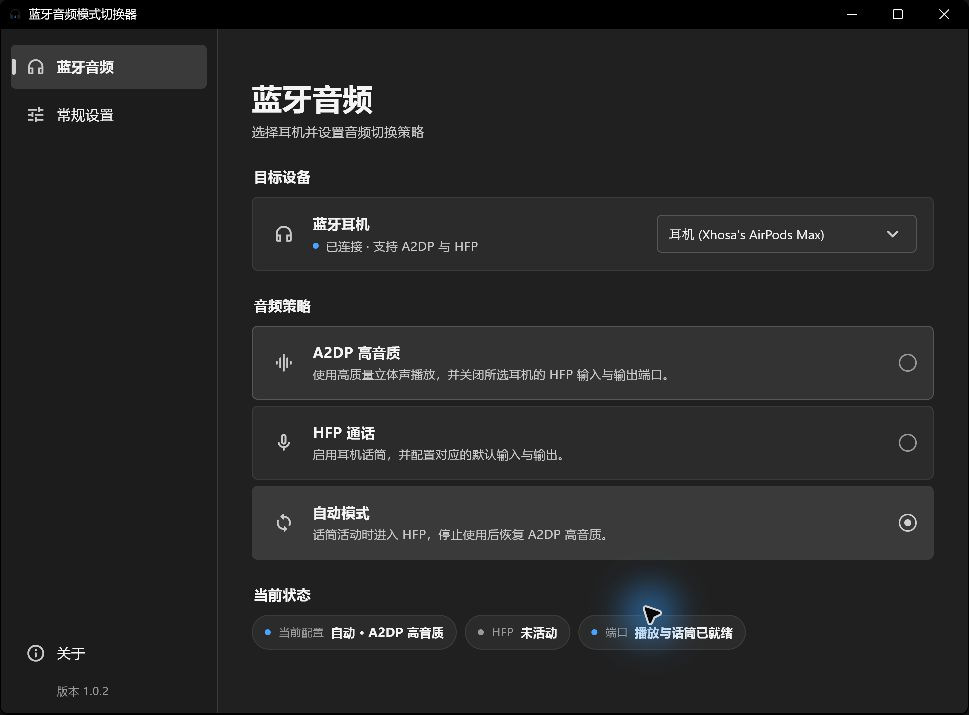
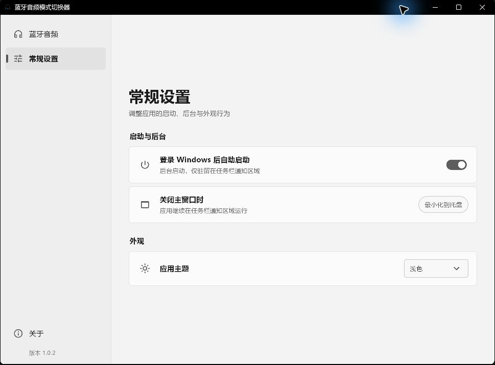

  
  <h1>蓝牙音频模式切换器</h1>
  
面向 Windows 11 的蓝牙耳机 A2DP / HFP 音频模式管理工具

  

    
    
    
  

在蓝牙耳机的 **A2DP 高音质**、**HFP 通话**与**自动模式**之间快速切换。应用按照 Windows `ContainerId` 识别同一台蓝牙设备的播放与话筒端口，并支持系统托盘、深浅主题、登录自启和设备重连恢复。

> 当前版本：**v1.0.2** · 仅支持 Windows 11 x64

## 下载与安装

- [下载安装程序](https://github.com/XhosaS/BluetoothManager/releases/download/v1.0.2/BluetoothAudioManager-Setup-v1.0.2.exe)（推荐）
- [下载完整 ZIP](https://github.com/XhosaS/BluetoothManager/releases/download/v1.0.2/BluetoothAudioManager-1.0.2-win-x64.zip)
- [查看全部版本与更新记录](https://github.com/XhosaS/BluetoothManager/releases)

运行安装程序时需要一次管理员权限，用于复制程序、注册配套 Windows 服务以及创建快捷方式；日常使用不需要重复确认 UAC。ZIP 解压后仍需运行其中的 `install.ps1` 完成安装。

## 界面预览

### 深色主题 · 蓝牙音频

### 浅色主题 · 常规设置

## 主要功能

- **A2DP 高音质**：使用高质量立体声播放，并关闭所选耳机的 HFP 输入与输出端口。
- **HFP 通话**：启用耳机话筒，并配置对应的默认输入与输出。
- **自动模式**：话筒活动时进入 HFP，停止使用后恢复 A2DP 高音质。
- **准确关联设备**：根据 Windows `ContainerId` 关联同一耳机的相关音频端口，不依赖易变化的显示名称。
- **后台常驻**：关闭主窗口后继续在通知区域运行，并可随 Windows 登录自动启动。
- **状态监测**：显示当前配置、HFP 活动情况和音频端口就绪状态。

Windows 11 的新蓝牙音频驱动通常使用统一播放端口。选择 HFP 后，只有应用真正打开耳机话筒时，蓝牙传输才会进入通话链路，因此暂时显示“未活动”是正常现象。

## 使用方法

1. 连接同时支持 A2DP 与 HFP 的蓝牙耳机。
2. 打开应用，从“目标设备”中选择耳机。
3. 选择 A2DP、HFP 或自动模式。
4. 在“当前状态”中确认配置和端口状态。
5. 关闭窗口后，应用会继续驻留在任务栏通知区域；单击托盘图标可重新打开。

## 系统要求

- Windows 11 x64
- 同时支持 A2DP 与 HFP 的蓝牙耳机
- 安装阶段需要管理员权限

版本历史请查看 [CHANGELOG.md](CHANGELOG.md)。开发、调试、构建和发布说明请查看 [AGENTS.md](AGENTS.md)。
